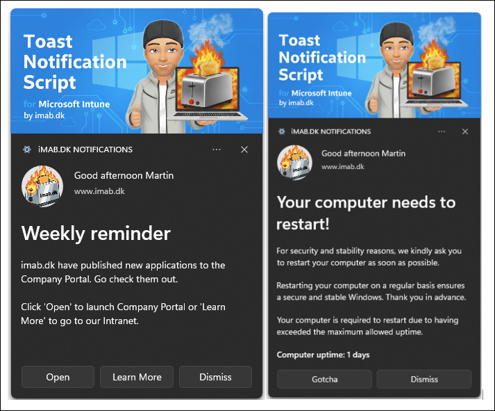
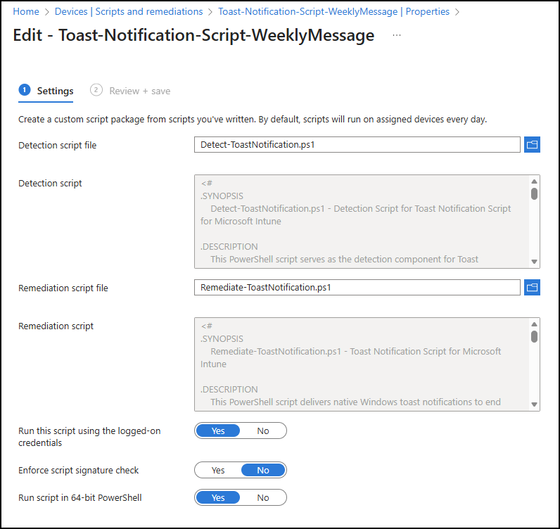

# Toast Notification Script

## Current Version: 3.0.3

Version 3.0 is a complete rewrite targeting **Microsoft Intune** and its **Remediations** feature.

### Download

- [Remediate-ToastNotification.ps1](Remediate-ToastNotification.ps1) - Main script
- [Detect-ToastNotification.ps1](Detect-ToastNotification.ps1) - Detection script for Intune
- [config-toast-weeklymessage.xml](config-toast-weeklymessage.xml) - Weekly message example
- [config-toast-pendingreboot.xml](config-toast-pendingreboot.xml) - Pending reboot example
- [config-toast-iosupdate.xml](config-toast-iosupdate.xml) - iOS update reminder example
- [config-toast-nofeatures.xml](config-toast-nofeatures.xml) - General notification (no conditional triggers)

**Documentation:** [https://www.imab.dk/windows-10-toast-notification-script/](https://www.imab.dk/windows-10-toast-notification-script/)

**Questions & Issues:** Visit the blog post above or open a [GitHub Issue](https://github.com/imabdk/Toast-Notification-Script/issues).

---

## What's in 3.0

- Intune Remediations support with proper exit codes and detection/remediation workflow
- Flexible scheduling - target specific days (comma-separated), specific hours, or "any time"
- Logging with rotation, IME output, and Event Log fallback
- Personalized greetings using the logged-on user's first name
- Multiple notification types: weekly reminders, uptime-based reboot prompts, general announcements
- Config validation that catches conflicting feature/button combinations before displaying anything
- Custom notification app - register your own app name in Action Center instead of showing "Windows PowerShell"
- Multi-language support (ships with en-US, da-DK, sv-SE)

### Scenarios

- **Weekly reminders** - routine announcements on specific days/hours
- **Reboot notifications** - remind users to restart when uptime exceeds a threshold
- **General notifications** - one-off or recurring messages (use `config-toast-nofeatures.xml`)
- **iOS/mobile updates** - notify users about required device updates via toast on their PC

### Requirements

- Windows 10 1709+ or Windows 11
- PowerShell 5.1+
- Intune managed device
- Must run in user context (not SYSTEM)
- Internet access if using online config/images

### Constrained Language Mode

The script works in CLM environments. However, when deployed via Intune IME on systems with AppLocker/WDAC enforced CLM, you may hit dot-sourcing errors because IME switches language modes mid-execution.

Error: `"Cannot dot-source this command because it was defined in a different language mode"`

**Workaround:** Sign the script with a code signing certificate from a trusted CA and enable "Enforce script signature check" in Intune. Signed scripts run in Full Language Mode, which avoids the boundary issue. The certificate needs to be in the Trusted Publishers store on managed devices.

### Quick Start

1. Download the scripts
2. Pick a config XML (or create your own) and host it somewhere accessible
3. Deploy in Intune Remediations:
   - Detection: `Detect-ToastNotification.ps1`
   - Remediation: `Remediate-ToastNotification.ps1`
   - Set the schedule based on your needs

### Configuration

The XML config file controls everything:

- Enable/disable toast, weekly messages, pending reboot checks
- Set target days and hours for scheduling
- Custom logo and hero images (local or URL)
- Action buttons, dismiss button, snooze with time picker
- Multi-language text blocks

---

## Version History

### 3.0.3
- Fixed a bug where the dismiss button was always forced on when ActionButton2 was enabled, regardless of the DismissButton config value

### 3.0.2
- Removed CLM compatibility claim (still under development)

### 3.0.1
- Fixed empty XML space in WeeklyMessage notifications by conditionally excluding the BodyText2 group

### 3.0.0
- Complete rewrite for Microsoft Intune

---

## Roadmap

- [ ] Intune IME compatibility fix - rework to avoid dot-sourcing issues with language mode switching
- [ ] Disk space monitoring
- [ ] Battery health notifications
- [ ] OneDrive sync issue alerts

---

## Legacy (Configuration Manager)

The old ConfigMgr version (2.3.0) is still available for download but no longer actively developed:

[ToastNotificationScript2.3.0.zip](https://github.com/imabdk/Toast-Notification-Script/blob/master/ToastNotificationScript2.3.0.zip)

It includes Software Center integration, task sequence support, and custom notification app registration. If you're still on ConfigMgr, it works fine - but new features only land in 3.x.

---

## License

MIT - see [LICENSE](LICENSE).

## Author

**Martin Bengtsson** - [imab.dk](https://www.imab.dk) / [@imabdk](https://github.com/imabdk)